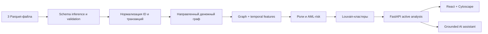

# Money Graph

**Локальная AML-платформа для анализа транзакционных сетей из Parquet-файлов.**

[](https://www.python.org/)
[](https://fastapi.tiangolo.com/)
[](https://react.dev/)
[](#проверки)

Money Graph принимает `nodes.parquet`, `edges.parquet` и
`transactions.parquet`, строит направленный денежный граф и формирует
объяснимые AML-гипотезы. Все вычисления выполняются локально; OpenAI нужен
только для опционального ассистента.

## Возможности

- интерактивный force-directed граф реальных переводов;
- AML-risk 0–100 для узлов, связей, транзакций и кластеров;
- обнаружение консолидации, fan-out, транзита, циклов и временных всплесков;
- поиск по исходному ID и раскрытие окрестности или кластера;
- карточки узлов с факторами риска и связанными транзакциями;
- изолированные анализы без demo fallback и смешивания наборов;
- интерфейс на русском и казахском;
- grounded AI-ассистент, ограниченный активным анализом.

Кейс HackAlem AI. Рабочее пространство AML-аналитика строит граф только по
активному пользовательскому набору `nodes + edges + transactions`, присваивает
объяснимые роли и риск узлам, связям и кластерам и выдаёт список «кого
проверять первым и почему». Встроенного demo fallback в API и интерфейсе нет.

Схема решения (данные → метрики → роли → интерфейс) — [`docs/solution_diagram.md`](docs/solution_diagram.md).

## Запуск продукта (одна команда)

```bash
./run_server.sh
```

Скрипт создаёт `.venv`, ставит Python-зависимости, устанавливает
frontend-зависимости, собирает React/Vite и
запускает FastAPI на <http://127.0.0.1:8000>. FastAPI обслуживает и `/api/*`,
и `frontend/dist`; секретов во frontend bundle нет.

Для разработки можно раздельно запустить backend и Vite (Vite проксирует
`/api` на порт 8000):

```bash
uvicorn backend.app:app --reload --port 8000
cd frontend && npm ci && npm run dev
```

CLI-пересчёт локального набора: `./run.sh [data_dir] [out_dir]`.

## Загрузка parquet

Компактный блок на **Обзоре** принимает ровно три файла (до 50 MB и
500 000 строк каждый). Каждый запуск получает отдельный `analysis_id` и
пишется в `runs/<analysis_id>/`. После валидации граф, карточки, кластеры,
приоритеты и AI-контекст переключаются на новый анализ. Кнопка `×` вызывает
`DELETE /api/analyses/{analysis_id}`, удаляет run и возвращает пустое состояние.

Обязательные схемы:

- `nodes.parquet`: `gid` (опционально `depth`, `is_seed`);
- `edges.parquet`: `src`, `dst`, `sum_kzt` (опционально `n_tx`, `depth`);
- `transactions.parquet`: `src`, `dst`, `sum_kzt`, `date`, опционально `tx_id`;
- распространённые алиасы:
  `gid/node_id/account_id/entity_id/id`,
  `src/source/from/sender/sender_id`,
  `dst/target/to/receiver/receiver_id`,
  `amount/sum_kzt/value`, `date/timestamp`, `tx_id/transaction_id/id`.

`transactions.parquet` — источник фактических переводов. Повторяющиеся пары
агрегируются с сохранением `tx_id`, дат и дополнительных полей; отсутствующие
в `edges` transaction-пары добавляются. Edge-only пары остаются структурными
с `has_transactions=false`. Если `edges` или `transactions` ссылаются на ID,
которого нет в `nodes`, весь набор отклоняется с перечнем неизвестных ID.
Текстовые ID безопасно перенумеровываются только внутри pipeline; API всегда
возвращает исходные значения.

API: `POST /api/analyses` (multipart fields `nodes`, `edges`, `transactions`) возвращает
`analysis_id`, `status`, schema preview и results. Передайте
`analysis_id=<id>` в `/api/summary`, `/api/graph`, `/api/nodes`,
`/api/clusters`, `/api/top` и `/api/ai/*`. Без него аналитические endpoints
отказываются работать, поэтому данные из `out/` не могут стать fallback.

## Поток данных



Основные API:

- `POST /api/analyses` — загрузить и проанализировать три файла;
- `GET /api/analyses/{analysis_id}` — статус и метаданные анализа;
- `DELETE /api/analyses/{analysis_id}` — удалить анализ;
- `GET /api/summary` — сводные показатели;
- `GET /api/graph` — полный граф, кластерный обзор или окрестность узла;
- `GET /api/nodes/{gid}` — карточка узла и транзакции;
- `GET /api/clusters`, `GET /api/top` — кластеры и приоритеты;
- `GET /api/ai/status`, `POST /api/ai/ask` — AI-ассистент.

## Интерфейс и масштабирование графа

- **Обзор** объединяет загрузку, интерактивный граф и карточку узла; отдельного
  пункта Network, декоративного hero, города, даты и текущего времени нет.
- Цвет узла/связи отражает AML-риск, размер узла — значимость, толщина связи —
  объём. Используется force-directed `cose`, fit, pan/zoom, поиск исходного ID,
  подсветка окрестности и возврат к общему виду.
- Сеть свыше 800 узлов сначала отдаётся как cluster overview. Клик раскрывает
  кластер, а поиск загружает серверную окрестность конкретного ID.
- Карточка показывает реальные атрибуты узла, входящие/исходящие суммы и
  транзакции, соседей, риск-факторы и сохранённые детали транзакций.
- Интерфейс по умолчанию русский; все статические подписи доступны также на
  казахском. Значения из parquet не переводятся.

## Объяснимый AML-риск

`src/moneygraph/risk.py` детерминированно рассчитывает `risk_score` 0–100,
`risk_level`, `risk_factors` и `risk_explanation`:

- для узла — объём, число контрагентов/операций, bridge-позиция, pass-through,
  циклы, быстрый транзит, синхронные поступления и риск соседей;
- для связи/транзакции — объём, интенсивность, риск концов и наличие реальных
  transaction rows;
- для кластера — средний/максимальный риск узлов, внутренний оборот и seed.

Это приоритизация и AML-гипотезы для проверки аналитиком, не юридические выводы.

## OpenAI-совместимый ассистент

Скопируйте `.env.example` в `.env` и задайте настоящий `OPENAI_API_KEY`
(обычно начинается с `sk-...`). URL вида
`https://platform.openai.com/p/...` — URL проекта, **не API key**. Ключ
хранится только в `.env` на backend и не попадает в браузер или git.
Поддержаны `OPENAI_BASE_URL`, `OPENAI_MODEL` и backward-compatible
`AI_API_KEY`, `AI_API_BASE_URL`, `AI_MODEL`. `GET /api/ai/status` сообщает
готовность; без ключа `POST /api/ai/ask` возвращает понятный 503.

Ассистент получает только ограниченный grounded context активного анализа.
System prompt запрещает посторонние темы, выдуманные gid/суммы и обвинения,
трактует загруженные значения как недоверенные данные (защита от prompt
injection), ограничивает размер контекста и возвращает source gid citations,
когда они доступны.

## Проверки

```bash
.venv/bin/pytest -q
cd frontend && npm run build
```

**Время работы pipeline: ~2–5 секунд** на исходном контрольном объёме (лимит по ТЗ — 5 минут).
На выходе в `out/`:

| Файл | Содержание |
|---|---|
| `nodes_roles.csv` | 2 248 строк — `gid, role, role_score, cluster_id, priority_score, evidence` + доп. метрики |
| `clusters.csv` | 68 строк — `cluster_id, n_nodes, n_seed, sum_kzt_internal, top_gids, hypothesis` |
| `top_nodes.csv` | 40 строк — `rank, gid, role, priority_score, why` |
| `graph_export.json` | тот же граф в JSON, для внешних инструментов |
| `transactions_enriched.parquet` | исходные детали транзакций + объяснимый risk |
| `graph.html` | **интерфейс просмотра** — открывается двойным кликом в браузере, интернет не нужен |
| `analysis_notes.md` | доп. наблюдения: устойчивость сети, циклы, синхронные платежи, пробелы в данных |

## Интерфейс просмотра (`out/graph.html`)

Один самодостаточный HTML-файл (vis-network инлайнится в файл при сборке,
`cdn_resources="in_line"` — работает офлайн, без сервера и интернета).

- **Схема сети**: направление стрелок = направление денег, цвет узла = роль,
  размер = `priority_score`, белая обводка = seed-клиент. Позиции узлов
  предрасчитаны (`spring_layout`) и зафиксированы — рендер мгновенный даже
  на 2 248 узлах.
- **Поиск по gid** — вводите id, узел подсвечивается и приближается камерой.
- **Фильтр по роли** — чекбоксы в легенде скрывают/показывают роль сразу
  на всей схеме (полезно, чтобы за секунду увидеть только coordinator/consolidator).
- **Фильтр по кластеру** — вписать номер кластера из `clusters.csv`.
- **Карточка узла** по клику — role, role_score, cluster_id, priority_score,
  in/out степень и обороты, полный текст `evidence`.

## Методология

### 1. Граф

`NetworkX DiGraph`, вес ребра — `sum_kzt` (используется в PageRank), отдельно
хранится `n_tx`. Кластеризация — на **неориентированной проекции** (это
явно оговорено, направление там не имеет смысла — см. ловушку №4 ниже).

### 2. Признаки (`src/moneygraph/features.py`)

| Признак | Смысл |
|---|---|
| `in_deg`/`out_deg` | от скольких/скольким разным клиентам получил/отправил |
| `in_kzt`/`out_kzt` | сумма полученного/отправленного внутри графа |
| `pagerank` | взвешенный по `sum_kzt` — общая «влиятельность» в потоке денег |
| `betweenness` | невзвешенная (по числу переходов) структурная позиция «моста»; объём денег уже учтён отдельно в `pagerank`/`in_kzt`/`out_kzt`, поэтому дублировать его в betweenness через веса не стали — см. ловушку №4 |
| `pass_through` | `out_kzt / in_kzt` — доля полученного, ушедшая дальше |
| `component_id` | номер слабосвязной компоненты (их 16 + 19 узлов вовсе без рёбер) |
| `in_cycle` | входит ли узел хотя бы в один возвратный цикл длиной ≤ 6 |
| `median_lag_days` / `max_same_day_payers` | из `transactions.parquet`: медианная задержка между получением и следующей отправкой; максимум разных плательщиков в один день (синхронность) |

### 3. Критерии ролей — явные правила с порогами

Пороги подобраны по распределению признаков в данных (см. `TH` в
`src/moneygraph/config.py`), не «на глаз» и не под конкретные gid:

| Роль | Правило | Обоснование порога |
|---|---|---|
| **coordinator** | `in_deg ≥ 8` **и** `out_deg ≥ 10` | пересечение порогов consolidator и distributor — узел одновременно консолидирует и распределяет. Даёт 9 узлов из 2 248 (0.4%) — редкая, наиболее «дорогая» категория, как и должно быть для кандидатов в организаторы |
| **consolidator** | `in_deg ≥ 8` (и не coordinator) | 8 — это 90+ перцентиль распределения `in_deg` среди узлов с входящими переводами (медиана — 1, 95-й перцентиль — 3); в данных это диапазон 8–24 разных плательщиков — уверенно выделяющаяся группа |
| **distributor** | `out_deg ≥ 10` (и не выше) | верхние ~9% узлов с исходящими переводами (макс. `out_deg` = 116); порог 10 совпадает с ориентиром из стартового кода организаторов |
| **transit** | `in_deg ≥ 1`, `out_deg ≥ 1`, `pass_through ∈ [0.8, 1.2]` | ровно диапазон, который организаторы указали как «72 узла с коэффициентом пропуска 0.8–1.2» — деньги проходят транзитом, не оседая и не приумножаясь |
| **terminal** | `out_deg = 0` | нет исходящих в выборке. **Разбито на 2 уровня доверия** — см. ниже |
| **peripheral** | всё остальное | низкая активность, ни один порог не сработал |

Порядок проверки — сверху вниз (coordinator проверяется первым, peripheral —
это остаток). Это не ML-модель, а прозрачное дерево решений: для любого gid
жюри можно за секунды показать, какая ветка сработала и почему.

### 4. Четыре ловушки кейса — как учтены

1. **`out_deg == 0` ≠ «деньги осели».** 444 узла на 4-м колене — это обрыв
   обхода. Роль `terminal` для них ставится с **пониженным `role_score`**
   (0.30–0.55 против 0.70–0.82 для настоящих терминалов на колене < 4), и в
   `evidence` явно написано «обрыв обхода, не подтверждено» — жюри сразу
   видно разницу в уверенности между 1 090 «настоящими» терминалами
   (depth < 4, обход дошёл до естественного конца) и 444 «обрубленными».
   Правило устроено так, чтобы **не полагаться только на `out_deg`**: если
   бы среди обрубленных узлов нашлись с `in_deg ≥ 8` (получают от 8+
   плательщиков несмотря на обрыв), они классифицировались бы как
   `consolidator` с пониженной уверенностью, а не как `terminal` — в
   предоставленных данных максимальный `in_deg` среди обрубленных узлов
   равен 3, то есть по факту такой конфликт не возникает, но правило
   универсально и не завязано на конкретные gid.
2. **У seed заниженный `in_kzt`.** Роли для seed не строятся на «сколько
   получил» вслепую: `pass_through` у seed действительно бывает аномально
   большим — это ожидаемо, и в `evidence` для seed-узлов добавляется пометка
   `(seed: входящие занижены)`. `priority_score` для seed **не получает
   бонус новизны** (см. ниже) — они и так известны аналитику, инструмент
   сфокусирован на *новых* точках интереса.
3. **Суммы vs количество переводов — разные сигналы.** Правила ролей строятся
   на **количестве уникальных контрагентов** (`in_deg`/`out_deg`), а не на
   суммах — так дробление на много мелких переводов не маскирует
   консолидацию/распределение. Суммы (`in_kzt`/`out_kzt`) используются
   отдельно в `priority_score` и в тексте `evidence`, чтобы аналитик видел
   обе величины одновременно.
4. **Граф направленный и взвешенный.** Роли считаются только на
   направленных метриках (`in_deg`, `out_deg`, `pass_through`, `pagerank`
   с весом `sum_kzt`). Единственное место, где используется неориентированная
   проекция — Louvain-кластеризация (`clusters.csv`), и это явно
   задокументировано здесь и в коде: кластер — это «сообщество», а не
   «направление потока».

### 5. Кластеризация

`nx.community.louvain_communities` на неориентированной проекции
(`weight=sum_kzt`, `seed=42` для воспроизводимости) → 67 сообществ,
плюс отдельная служебная группа для 19 seed-клиентов вовсе без единого
ребра в выборке (это честная категория «нет данных о движении средств», а
не искусственные микрокластеры по одному узлу).

Гипотеза по кластеру строится правилом (не текст от LLM), в зависимости от
числа seed, доминирующей роли и размера:
- **9 кластеров содержат 2+ seed-клиентов** (совпадает с ориентиром
  организаторов — «8 устойчивых сообществ с более чем одним seed») —
  это кандидаты в «инфраструктуру одной группы», а не случайные пересечения.
- Кластеры с доминирующей ролью `distributor` помечаются как «сеть выплат
  вниз по цепочке».
- Кластеры размером < 3 узлов — микрофрагменты, отдельно от основной сети.

### 6. `priority_score` — кого смотреть первым

```
priority_score = 0.35 · role_weight            (вес роли: coordinator=1.0 … peripheral=0.1)
               + 0.25 · percentile(pagerank)
               + 0.20 · percentile(in_kzt + out_kzt)
               + 0.15 · percentile(betweenness)
               + 0.05 · novelty                (1, если узел НЕ входит в известные 81 seed)
```

Бонус `novelty` — намеренное решение: сеть уже содержит 81 известного
курьера, и цель инструмента — сместить фокус на **новые** точки
консолидации/координации (см. «Эффект от решения» в ТЗ), а не пересчитать
приоритет для уже известных лиц.

### 7. Распределение ролей на предоставленных данных

```
terminal        1534   (из них 444 — обрубленные 4-м коленом, role_score понижен и явно помечен;
                         1 090 — реальные терминалы на колене < 4)
peripheral       571
transit           71
distributor       55
coordinator        9    (in_deg 8–24 И out_deg 8–61 одновременно)
consolidator       8    (in_deg 8–13, все — не обрубленные, депт < 4)
```

## Ограничения подхода

- **Нет ground truth** — пороги обоснованы распределением признаков и
  ориентирами из ТЗ, но это гипотезы для проверки, не доказанные факты
  (см. `careful wording` ниже).
- **Обрыв на 4-м колене** снижает уверенность (`role_score`), но не
  устраняет её полностью без данных о переводах за пределами выборки —
  честно отражено в `evidence` и `analysis_notes.md`.
- **Порог 5 000 KZT** — дробление сумм ниже порога в принципе не видно
  этому инструменту; это явный пробел, зафиксированный в `analysis_notes.md`.
- **Louvain недетерминирован в общем случае** между запусками разных версий
  библиотек — зафиксирован `seed=42` для воспроизводимости в рамках среды.
- **NetworkX in-memory** подходит для хакатонного объёма, но для графов на
  миллионы узлов потребуется распределённый графовый движок и приближённые
  центральности.

## Explainability и приватность

- Каждая роль — результат явного порогового правила, не «чёрный ящик»
  (см. таблицу выше и код `assign_roles()` — там же, где считается роль,
  генерируется человекочитаемый `evidence` с реальными числами).
- Формулировки — гипотезы («вероятная точка консолидации», «кандидат в
  организаторы»), а не утверждения о виновности.
- Никаких внешних данных, ФИО, ИИН — только `gid`, суммы и структура связей,
  как и предоставлено организаторами.
- Ни один gid не зашит в код: все правила — функции признаков, посчитанных
  из `data/*.parquet` на лету.

## Масштабирование до ~1 млн узлов

Текущий подход (полный граф в памяти, точные PageRank/betweenness,
Louvain на всём графе) упирается в память и время уже на десятках тысяч
узлов для `betweenness_centrality` (O(V·E), не параллелится тривиально).
При росте до ~1 млн узлов имеет смысл:

1. **Хранение**: перейти с in-memory NetworkX на графовую БД (Neo4j,
   ArangoDB) или колоночный формат рёбер в Parquet/Arrow с обработкой
   через `polars`/`igraph`/`graph-tool` (на порядок быстрее NetworkX на
   больших графах).
2. **Betweenness** — заменить на приближённый (`k`-sampling в
   `nx.betweenness_centrality(k=...)`) или отказаться в пользу PageRank +
   структурных признаков локальной окрестности (дешевле, распараллеливается).
3. **PageRank / Louvain** — считать распределённо (Spark GraphX,
   GraphFrames, или `igraph`/`graph-tool` в один процесс, но
   многопоточно) — оба алгоритма имеют хорошо масштабируемые реализации.
4. **Роли** — пороговые правила уже считаются построчно/векторно (pandas) —
   это не узкое место; на 1 млн строк pandas справится за секунды при
   условии, что признаки уже посчитаны.
5. **Визуализация** — 1 млн узлов нельзя рисовать целиком (vis-network
   уже тяжело на этом объёме) — нужен предварительный отбор (топ-N по
   `priority_score`, окрестность конкретного gid, схлопывание кластеров в
   один узел с раскрытием по клику — иерархическая визуализация).
6. **Инкрементальность** — при регулярных выгрузках считать признаки не
   с нуля, а инкрементально обновлять только затронутые компоненты графа.

## Структура репозитория

```
Hackalem/
├── backend/                 # FastAPI, upload API, active runs, AI assistant
│   ├── routers/             # analyses, graph, nodes, clusters, AI
│   ├── upload_service.py    # schema inference и строгая валидация
│   └── data_store.py        # изолированное чтение analysis_id
├── frontend/                # React + TypeScript + Cytoscape
│   └── src/                 # Overview, граф, RU/KK, API client
├── src/moneygraph/          # аналитический Python-пакет
│   ├── pipeline.py          # оркестрация полного расчёта
│   ├── features.py          # графовые и временные признаки
│   ├── roles.py             # объяснимые роли
│   ├── risk.py              # AML-risk узлов/рёбер/кластеров
│   └── exports.py           # CSV, JSON, enriched parquet
├── data/                    # локальный контрольный набор
├── runs/                    # пользовательские анализы (gitignored)
├── out/                     # CLI-результат (генерируется)
├── tests/                   # API и pipeline smoke-тесты
├── docs/solution_diagram.md
├── requirements.txt
├── run.sh                   # CLI-пересчёт
├── run_server.sh            # сборка frontend + запуск продукта
└── README.md
```

## Сценарий демонстрации

1. Запустить `./run_server.sh` и открыть <http://127.0.0.1:8000>.
2. Выбрать три Parquet-файла и нажать **АНАЛИЗИРОВАТЬ**.
3. Раскрыть кластер или найти узел по исходному ID.
4. Показать risk score, факторы, соседей и реальные транзакции в карточке.
5. Переключить язык на **Қазақша**.
6. Удалить анализ кнопкой `×` и загрузить другой набор.
