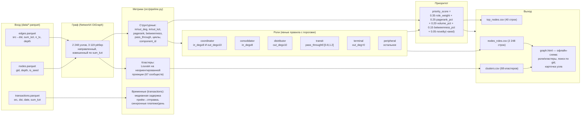

# Схема решения

Один слайд: данные → метрики → роли → интерфейс.

**Аналитик:** получает `data/*.parquet` → запускает `./run.sh` → за секунды получает
`out/nodes_roles.csv`, `out/clusters.csv`, `out/top_nodes.csv` и открывает
`out/graph.html`, где ищет любой из 2 248 gid, видит его роль, кластер и
обоснование, и формирует список на углублённую проверку.
