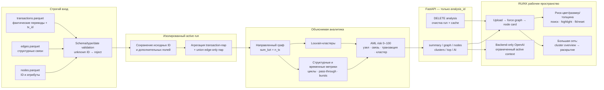

# Схема решения

`transactions.parquet` является источником фактических переводов. Исходные
ID и детали операций сохраняются, неизвестные ID не подменяются техническими
или демонстрационными узлами. Все risk-формулировки — AML-гипотезы для проверки.
